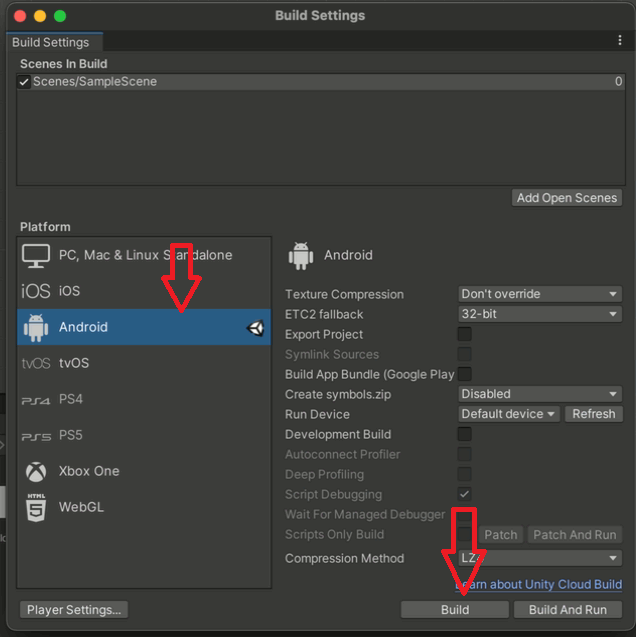
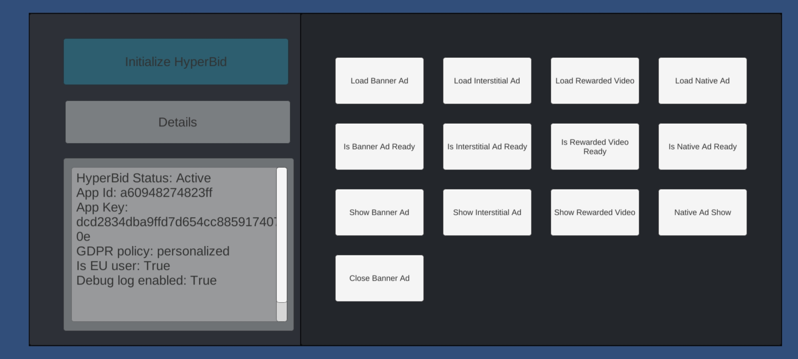

<h1>HyperBid Unity Demo</h1>

HyperBid is a complete mediation solution for Android and iOS games. It offers support for a large selection of ad providers and uses header bidding to help developers maximize their revenue from ads using header bidding.

<li>dashboard: <a href="https://app.hyperbid.com">https://app.hyperbid.com</a></li>
<li>documentation: <a href="https://docs.hyperbid.com">https://docs.hyperbid.com</a></li>
 
<h1>Unity Support</h1>

HyperBid provides unity support via the HyperBid Unity SDK for seamless integreation into Unity games. Currently only Android and iOS platforms are supported

<li>documentation: <a href="https://docs.hyperbid.com/#/en-us/unity">https://docs.hyperbid.com/#/en-us/unity</a></li>
 
<h2>Running the demo</h2>

<ol><li>Download Unity <b>2020.3.17f1</b> or newer</li>
<li>Clone this repository using the command:</li>
<code>
git clone https://github.com/hyperbid/hyperbid-unity-demo
</code>
 
<li>Open the project folder with Unity</li>
<li>Go to File->Build Settings</li>
<li>Switch platform to iOS or Android and click *Build*</li></ol>
 
</img>
 
 

Since HyperBid only supports Android and iOS, it is <b>required</b> to build the project for the specific platform in order to test it. HyperBid does not support the Unity Editor at the moment.

<h1>Unity Demo</h1>

The demo contains code samples for the most common types of ads that HyperBid provides.

<li>Banner Ads       -> `Assets/Scripts/BannerAdComponent`</li>
<li>Interstitial Ads -> `Assets/Scripts/InterstitialAdComponent`</li>
<li>Rewarded Videos  -> `Assets/Scripts/RewardedVideoComponent`</li>
<li>Native Ads       -> `Assets/Scripts/NativeAdComponent`</li>
 

<h2>HyperBid Initialization</h2>

Before the SDK can be used it requires to be initialized. In the demo this is done by pressing the `Initialize HyperBid Button`, before initialization if the user is in the EU the GDPR policy must be accepted. This is handled by the `getUserLocation` method. Please check `Assets\Scripts\HyperBidComponent.cs` for more details.

<code>
//Check if the current network is EU
HBSDKAPI.getUserLocation(new IsGDPRRequiredListener());
</code>

<h2>Common Issues</h2>
<h5>Cannot parse project property android.enableR8=‘’ of type ‘class java.lang.String’ as boolean. Expected ‘true’ or ‘false’.</h5>
You are running an older version of unity, this demo requires <b>2020.3.17f1</b> or newer.
 
<h4>HyperBid has failed to initalize</h4> 
Make sure you are running the apk/app on a device and not using the Unity Editor
 
<h4>The placement load is too frequent within the specified time </h4> 
You are trying to load too many ads in a short period of time, please wait for the timeout until loading a subsequent ad